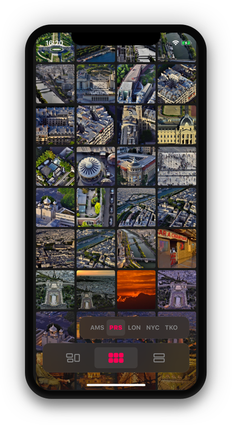
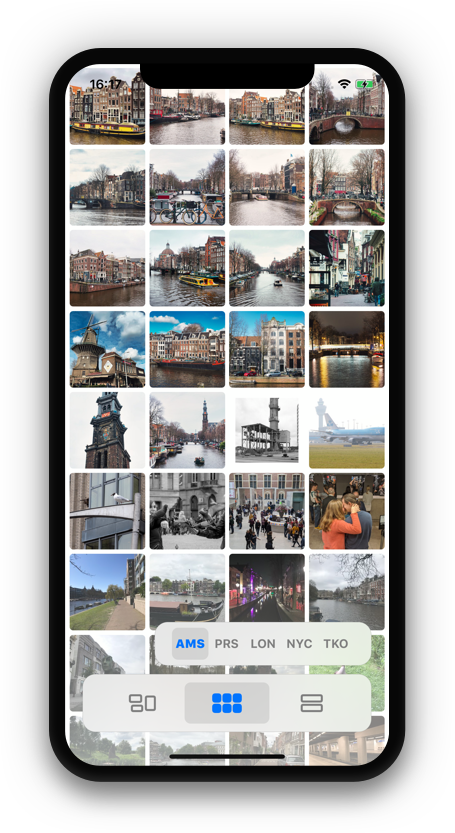
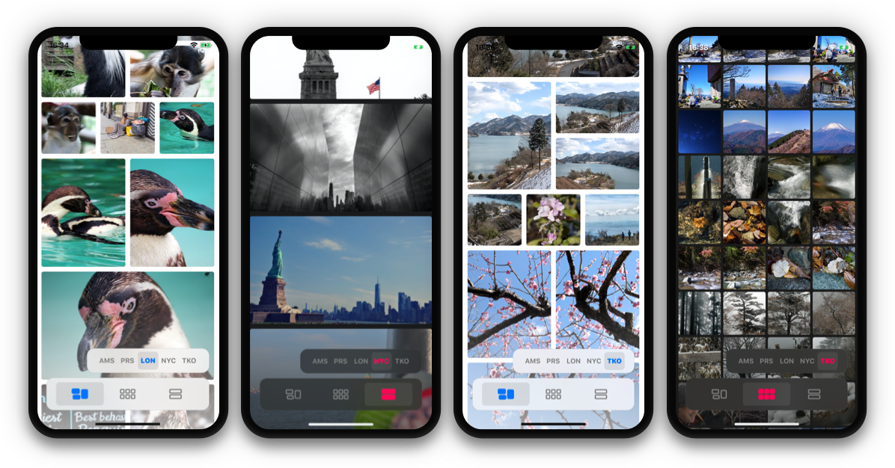

<h1 align="center">Photos App Assignment</h1><bl>

    **The** photo app that shows you arbitrary pictures of arbitrary cities. 😁

 	
 	

 

## Table of Contents
- [Introduction](#introduction)
- [Features](#features)
- [API & Networking](#api-&-networking)
- [Image Cache & Loading](#image-cache-&-loading)
- [The Photos](#the-photos)
- [The Menus](#the-menus)

## Introduction
This exercise was the perfect opportunity for me to do a deep dive into some new technologies like diffable data sources and compositional layouts while at the same time creating the most efficient camera roll app as I possibly can. Below I explain in more detail how I used certain techniques and why I made the choices that I made. I hope you enjoy the read and have fun going through the code.

 	

## Features
- camera roll
- displays images as efficiently as possible
- completely transparent image loading
- junk-free scrolling

## API & Networking
One of the first things I did was look for a public image API. Important to me was that the api had a reasonable requests-limit, paging-data support and that the photos weren't to bad. I landed on the [Flickr public api](https://www.flickr.com/services/api/). The app uses only one of the many Flickr endpoints and that is the search endpoint (flickr.photos.search). With this I can generate endless lists of data based on a geo location.

To load the data I created an extension on URLSession that is responsible for calling the API, handling errors and passing the data to a parser. This extension is called with a generic `Request<T>` object that defines it's own endpoint and it's prefered data parsing method. This way I can reuse my networking code between the data- and image-requests.

## Image Cache & Loading
As caching mechanism I build a wrapper around `NSCache` that has three main functions, prefetch images from the network, store images in the cache and pass the right image back to it's requester, the photo view. The prefetching is triggered by `UICollectionViewDataSourcePrefetching`'s `prefetchItemsAt` method and makes sure that images are loaded and ready for the moment the cell will ask for it. The image cache also keeps track of which items are currently being prefetched and the closures that still need to be completed.

## The Photos
For displaying the images I used a `UICollectionViewController` with a diffable data source. This data source helps with updating the views when the new data comes in by creating a snapshot of the current data, updating it with the new data and then applying the updated snapshot to the data source. This makes the coupling between the data and the view extremely efficient. More photo's are being loaded on the fly while scrolling down in the collection, all as transparent and junk-free as possible.

## The Menus
There are two tab-bar-like menu's, the smaller top menu let's you change the geo location used to search the images and so creating different sets of data to test the app with. You can choose between Amsterdam (**AMS**), Paris (**PRS**), London (**LON**), New York (**NYC**) and Tokyo (**TKO**).

The next menu let's you change the layout of the collection view cells. You can choose between the casual **Inspirational** layout, the high performant **Grid** layout and the large **Rectangle** layout. With some more time I would love to add the possibility to load images of different sizes corresponding to the size of the cell.

## Thank You
Thank you for looking at this project, please let me know if you have any questions.
